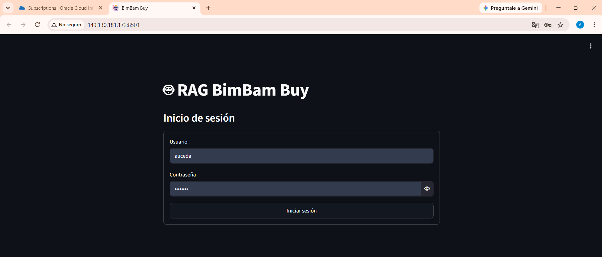
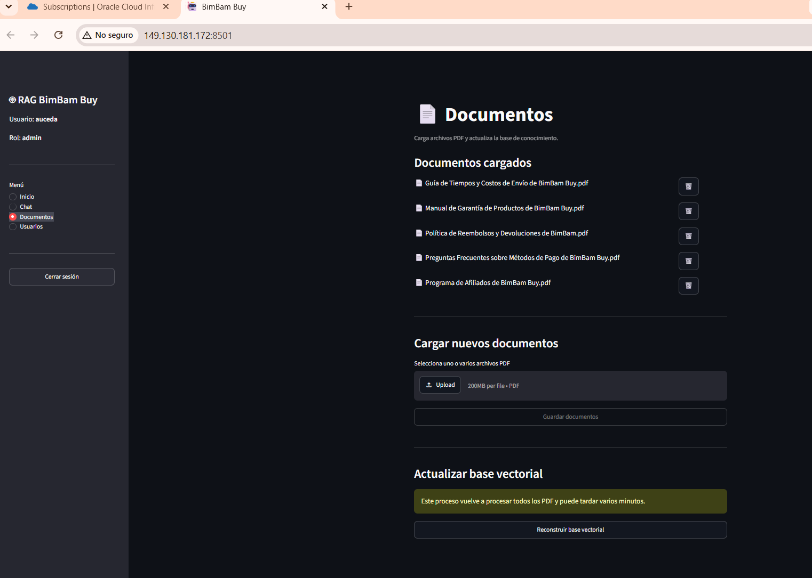
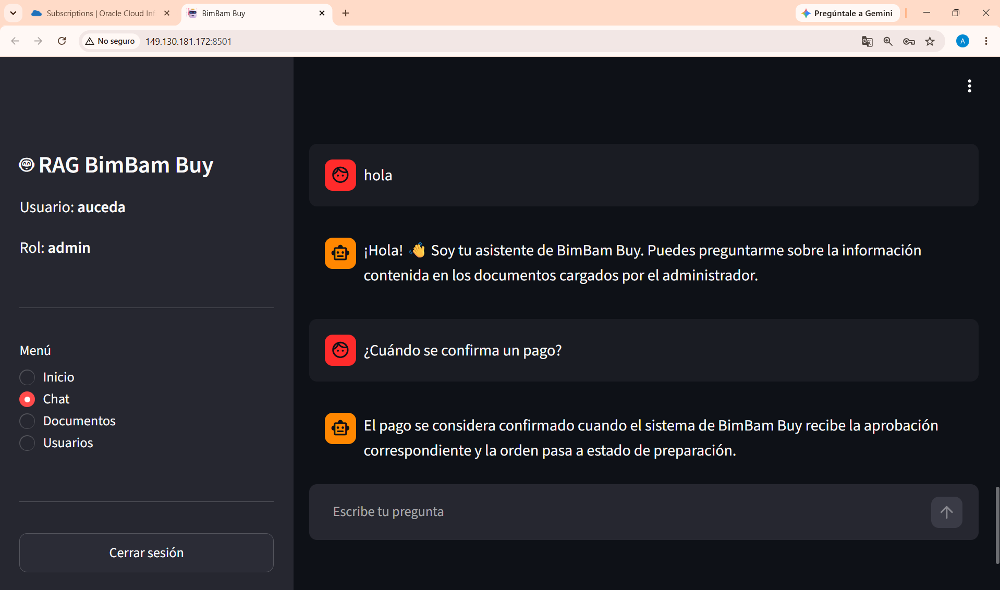

# 🤖 CHALLENGE-RAG-PYTHON


---

# 📖 Descripción

CHALLENGE-RAG-PYTHON es un sistema **Retrieval-Augmented Generation (RAG)** desarrollado con Python que permite consultar documentos PDF mediante Inteligencia Artificial.

El proyecto utiliza **LangChain**, **ChromaDB**, **Sentence Transformers** y **Ollama** para generar respuestas basadas únicamente en el contenido de los documentos cargados.

La aplicación cuenta con una interfaz web desarrollada con **Streamlit**, autenticación de usuarios, administración de documentos y despliegue en **Oracle Cloud Infrastructure (OCI)**.

---

# 🚀 Características

- ✅ Autenticación de usuarios
- ✅ Gestión de documentos PDF
- ✅ Base vectorial con ChromaDB
- ✅ Embeddings mediante Sentence Transformers
- ✅ Respuestas utilizando Llama 3.2 con Ollama
- ✅ Chat Web desarrollado con Streamlit
- ✅ Referencias a las fuentes utilizadas
- ✅ Despliegue en Oracle Cloud
- ✅ Inicio automático mediante systemd

---

# 📸 Capturas de pantalla

## 🔐 Inicio de sesión



---

## 📄 Gestión de documentos



---

## 💬 Chat RAG Funcionando en Oracle



---


# 🏗 Arquitectura

```text
                 Usuario
                     │
                     ▼
             Streamlit Web
                     │
                     ▼
              LangChain RAG
                     │
      ┌──────────────┴──────────────┐
      ▼                             ▼
 ChromaDB                    Ollama (Llama 3.2)
      │
      ▼
Documentos PDF
```

---

# 🛠 Tecnologías utilizadas

| Tecnología | Descripción |
|------------|-------------|
| Python 3.12 | Lenguaje principal |
| LangChain | Framework RAG |
| ChromaDB | Base de datos vectorial |
| Sentence Transformers | Generación de embeddings |
| Ollama | Ejecución local del LLM |
| Llama 3.2 | Modelo de lenguaje |
| Streamlit | Interfaz Web |
| Streamlit Authenticator | Login |
| Git | Control de versiones |
| GitHub | Repositorio |
| Oracle Cloud Infrastructure | Despliegue |
| Ubuntu 24.04 | Sistema Operativo |

---

# 📂 Estructura del proyecto

```text
CHALLENGE-RAG-PYTHON
│
├── app/
├── data/
│   ├── chroma/
│   └── documentos/
│
├── screenshots/
│
├── web_app.py
├── main.py
├── create_admin.py
├── requirements.txt
├── README.md
└── .env
```

---

# ⚙ Instalación

## Clonar repositorio

```bash
git clone https://github.com/aucedadev/CHALLENGE-RAG-PAYTHON.git

cd CHALLENGE-RAG-PYTHON
```

## Crear entorno virtual

Windows

```bash
python -m venv venv

venv\Scripts\activate
```

Linux

```bash
python3 -m venv venv

source venv/bin/activate
```

## Instalar dependencias

```bash
pip install -r requirements.txt
```

---

# 🤖 Instalar Ollama

Descargar Ollama

https://ollama.com/

Descargar el modelo

```bash
ollama pull llama3.2
```

---

# ▶ Ejecutar la aplicación

```bash
streamlit run web_app.py
```

La aplicación estará disponible en:

```text
http://localhost:8501
```

---

# ☁️ Despliegue

La aplicación fue desplegada en **Oracle Cloud Infrastructure (OCI)** utilizando una máquina virtual Ubuntu 24.04.

Características del despliegue:

- Ubuntu 24.04
- Oracle Cloud Infrastructure
- Ollama
- Streamlit
- Servicio systemd
- Puerto TCP 8501 habilitado

La aplicación es accesible mediante una dirección IP pública y el servicio inicia automáticamente al encender la máquina virtual.

http://149.130.181.172:8501/

usuario comun

usuario:root
contraseña:root1234
---
#  Ejemplo de preguntas realizadas
¿Cuál es el propósito de la Política de Reembolsos y Devoluciones de BimBam Buy?


¿Qué hago si mi pago fue rechazado?


¿Cuándo se confirma un pago?


¿Cuál es el propósito de la Guía de Tiempos y Costos de Envío de BimBam Buy?


# 🔐 Autenticación

El sistema incorpora autenticación mediante Streamlit Authenticator.

Características:

- Login
- Logout
- Usuarios administradores y usuarios estandar
- Control de acceso(desactivo y activo usuarios) solo el admin

---

# 📄 Flujo del sistema

1. El usuario inicia sesión.
2. Carga documentos PDF(solo admin).
3. Se generan embeddings.
4. Los documentos se almacenan en ChromaDB.
5. El usuario realiza una pregunta.
6. LangChain recupera el contexto.
7. Ollama genera la respuesta.
8. Streamlit muestra la respuesta junto con las fuentes utilizadas.

---

# ✅ Funcionalidades implementadas

- [x] LangChain
- [x] ChromaDB
- [x] Ollama
- [x] Llama 3.2
- [x] Streamlit
- [x] Login
- [x] Gestión de documentos
- [x] Oracle Cloud
- [x] Inicio automático mediante systemd
---

# 👨‍💻 Autor

**Anthony Frank Uceda Alfaro**

Ingeniero de Sistemas

Proyecto desarrollado como práctica de Inteligencia Artificial Generativa utilizando LangChain, ChromaDB, Ollama y Oracle Cloud Infrastructure.
